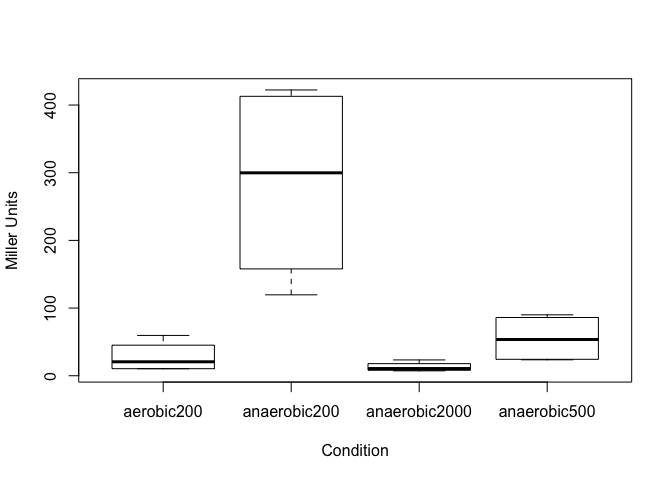
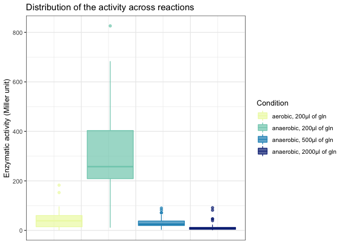
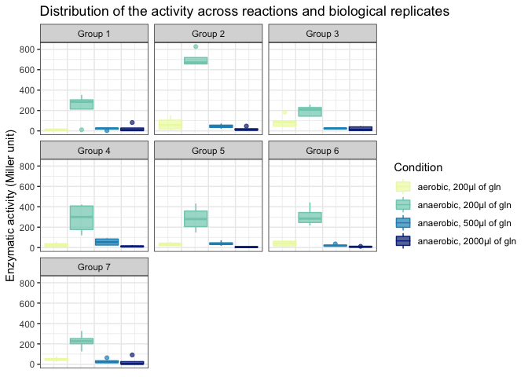

Microbiology Practical: analysis of ß-galactosidase assays
================
L. Paoli
2019-03-07

-   [Introduction : R Basics](#introduction-r-basics)
-   [Suggested scripting for the report](#suggested-scripting-for-the-report)
-   [More advanced version of the analysis](#more-advanced-version-of-the-analysis)

This document presents different options to analyse the data from the beta-galactosidase assays conducted during the Microbiology Practicals (Exp. 6.6).

After a quick introduction, a first part describes the code suggested in the practical to perform the analysis, a second part explores more complex analyses and visualisations. This can, but does not have to, be used for writing the report.

Introduction : R Basics
-----------------------

A line starting with a hastag (\#) is a comment :

`#This is a comment, it is not doing anything`

You can store objects, *i.e. numbers, strings, vectors or data.frames (= tables)* in a **variable**. Subsequently calling the variable will return the object.

``` r
a = 2
b = 3
a
```

    ## [1] 2

``` r
c = a + b
c
```

    ## [1] 5

``` r
str = 'Hello world'
str
```

    ## [1] "Hello world"

A very convenient type of object are the functions. A function is an easy way to call a chunk of prewritten code. As example you can compute a sum, calculate a mean or bind objects into a vector.

``` r
vect = c(a, b, c)
vect
```

    ## [1] 2 3 5

``` r
sum(vect)
```

    ## [1] 10

Whenever you are note sure of what a function does, you can look at its documentation : `help(sum)`

Suggested scripting for the report
----------------------------------

### Loading data

The data is already available in a spreadsheet and the file can be loaded directly.

``` r
# Read the into a data.frame
df <- read.table("FS_experiment_6_6_OD summary round1.tsv",header=TRUE)
# Select the results of our group (called group 4 in this case)
df <- df[df$biological_replicate=='4',-1]

# Derive activity according to the formula
v <- 0.2 # The value of the volume (0.2 ml) of the culture used for the experiment
df$activity <- (df$OD420*1000)/(v*df$dt*df$OD600)
# Print the table
df
```

    ##     technical_replicate     condition OD600 OD420 dt_min   activity
    ## 14                    A    aerobic200 0.860 0.025     14  10.382060
    ## 15                    B    aerobic200 1.076 0.027     12  10.455390
    ## 16                    C    aerobic200 1.280 0.244     16  59.570312
    ## 17                    D    aerobic200 1.300 0.104     13  30.769231
    ## 43                    A  anaerobic200 1.776 2.100     14 422.297297
    ## 44                    B  anaerobic200 1.456 1.410     12 403.502747
    ## 45                    C  anaerobic200 1.448 0.554     16 119.561464
    ## 46                    D  anaerobic200 2.188 1.116     13 196.174940
    ## 72                    A  anaerobic500 2.192 0.504     14  82.116788
    ## 73                    B  anaerobic500 2.620 0.566     12  90.012723
    ## 74                    C  anaerobic500 1.724 0.130     16  23.564385
    ## 75                    D  anaerobic500 3.076 0.200     13  25.007502
    ## 101                   A anaerobic2000 3.652 0.074     14   7.236739
    ## 102                   B anaerobic2000 3.124 0.067     12   8.936193
    ## 103                   C anaerobic2000 3.208 0.240     16  23.379052
    ## 104                   D anaerobic2000 3.480 0.112     13  12.378426

### Visualise results

A good way to visualise this type of data is to make a box-and-whisker plot to show activity by condition.

``` r
boxplot(df$activity ~ df$condition, ylab="Miller Units", xlab="Condition")
```



### Statistical analysis

For each pair of reactions you can perform a Student’s t-test to determine if they are statistically different from each other.

Exemple comparing condition *aerobic with 200µL of glutamin* and with the condition *anaerobic with 200µL of glutamin*:

``` r
t.test(df$activity[df$condition=='aerobic200'],df$activity[df$condition=='anaerobic200'])
```

    ## 
    ##  Welch Two Sample t-test
    ## 
    ## data:  df$activity[df$condition == "aerobic200"] and df$activity[df$condition == "anaerobic200"]
    ## t = -3.3781, df = 3.1428, p-value = 0.04024
    ## alternative hypothesis: true difference in means is not equal to 0
    ## 95 percent confidence interval:
    ##  -494.14419  -21.03553
    ## sample estimates:
    ## mean of x mean of y 
    ##  27.79425 285.38411

In this case, the p-value indicates that the results for the two conditions are significantly different from one another (p &lt; 0.05).

**To do:**

1.  Test each pair of reactions. Have a look at `help(pairwise.t.test)`.
2.  The t-test assumes that the data is normally distributed, is this reasonable in this case?

### Application to a larger dataset (from all groups)

Note that there is an additional column to show which group the measurement came from.

**To do:**

1.  Repeat the calculation of activity.
2.  Visualise the data by group, reaction, and by both group and reaction separately.
3.  Test for statistical difference between pairs of groups in each reaction.
4.  Do the same reactions from different groups agree with each other or is there a strong ‘batch effect’?
5.  If you can combine the data from some or all of the different groups, which pairs of reactions now show significant difference from each other?

More advanced version of the analysis
-------------------------------------

### Loading and processing data

``` r
## import libraries to use additional functions 
suppressMessages(library(tidyverse)) # if it failes, use : 'install.packages('tidyverse')' first
library(readxl) # if it failes, use : 'install.packages('readxl')' first

## Load the data directly form the excel file 
# Check the current directory:
getwd()
```

    ## [1] "/Users/paolil/polybox/PhD/Teaching/2019_Practical/Practical_Microbio"

``` r
# Check if the file is there:
list.files()
```

    ## [1] "FS_experiment_6_6_OD summary round1.tsv" 
    ## [2] "FS_experiment_6_6_OD summary round1.xlsx"
    ## [3] "Practical_Microbio.Rproj"                
    ## [4] "README_files"                            
    ## [5] "README.md"                               
    ## [6] "README.Rmd"

``` r
# If you need to change your directory, use 'setwd('/where/you/need/to/go/')'
# define the name of the file. You can directly use '/where/you/need/to/go/file_name.xlsx'
# if you want to access the file without changing directory.
file_path = 'FS_experiment_6_6_OD summary round1.xlsx' 
# Load the file into a data.frame using the column names:
betagal_results = read_excel(file_path, col_names = T)
# Look at the data.frame:
betagal_results
```

    ## # A tibble: 116 x 6
    ##    biological_replicate technical_replicate condition  OD600 OD420 dt_min
    ##                   <dbl> <chr>               <chr>      <dbl> <dbl>  <dbl>
    ##  1                    1 A                   aerobic200 0.576 0.012     12
    ##  2                    1 B                   aerobic200 0.46  0.016     12
    ##  3                    1 C                   aerobic200 1.28  0.004     10
    ##  4                    1 D                   aerobic200 0.596 0.021     12
    ##  5                    2 A                   aerobic200 0.107 0.008     15
    ##  6                    2 B                   aerobic200 0.131 0.035     15
    ##  7                    2 C                   aerobic200 0.102 0.002     15
    ##  8                    2 D                   aerobic200 0.096 0.044     15
    ##  9                    3 A                   aerobic200 1.21  0.168     15
    ## 10                    3 B                   aerobic200 0.864 0.222     15
    ## # … with 106 more rows

``` r
## Format and process the data 
# Create a variable for Reactions, combining condition and gln :
betagal_results = mutate(betagal_results,
                         Condition = paste(gsub('[0-9]', '', condition),
                                           ', ',
                                           gsub('[a-z]', '', condition),
                                           'µl of gln',
                                           sep = ''))
# Transform as a factor to keep the same order as the script
betagal_results$Condition = factor(betagal_results$Condition,
                                   levels = unique(betagal_results$Condition))
# Add group to biological replicates and format as factor for compatibility.
betagal_results$biological_replicate = 
  factor(paste('Group', betagal_results$biological_replicate))
# Compute and add activity into the data.frame using the equation of the script:
v = 0.2
# Note that you can directly call the column by names inside the function, using `` when
# the variable name has spaces. In base R you would use betagal_results$column
betagal_results = mutate(betagal_results, Activity = (OD420*1000)/(v*dt_min*OD600))
```

### Visualisation of the data

``` r
# Here, I suggest we use a wdely used visualistion package called ggplot2.
# Although the syntax is quite different from usual R, it provides nice plotting options.

# First we can look at the activity between conditions, i.e. combining biological 
# and technical replicates.

# Here I define a set of custom colors
custom_cols = c('#edf8b1', '#7fcdbb', '#1d91c0', '#0c2c84')

# Note @Till : if you use fill, color or another aes parameter with a characters or
# factors (i.e. not a continuous variable), group will inherit the values so you don't
# need to specify it.
ggplot(data = betagal_results) + 
  geom_boxplot(aes(y = Activity, fill = Condition, col = Condition), alpha = .7) +
  theme_bw() + theme(axis.text.x = element_blank(),
                     axis.ticks.x = element_blank()) +
  ylab('Enzymatic activity (Miller unit)') +
  ggtitle('Distribution of the activity across reactions') +
  scale_fill_manual(values = custom_cols) +
  scale_color_manual(values = custom_cols)
```



``` r
# We can also observe the variability of the results among groups.
ggplot(data = betagal_results) + 
  geom_boxplot(aes(y = Activity, fill = Condition, col = Condition), alpha = .7) +
  facet_wrap(~biological_replicate) +
  theme_bw() + theme(axis.text.x = element_blank(),
                     axis.ticks.x = element_blank()) +
  ylab('Enzymatic activity (Miller unit)') +
  ggtitle('Distribution of the activity across reactions and biological replicates') +
  scale_fill_manual(values = custom_cols) +
  scale_color_manual(values = custom_cols)
```



``` r
# Note that with this notation, we are group 4.
```

### Statistical analysis

The usual approach would be to use t-test pairwise. Note that when doing so, you need to correct for multiple testing, indeed, if you do a 100 random pairwise comparisons with a confidence interval of 95%, chances are you will have 5 false positives results.

``` r
# All the pairwise tests between conditions using the default correction (Holmes):
pairwise.t.test(betagal_results$Activity, betagal_results$Condition)
```

    ## 
    ##  Pairwise comparisons using t tests with pooled SD 
    ## 
    ## data:  betagal_results$Activity and betagal_results$Condition 
    ## 
    ##                          aerobic, 200µl of gln anaerobic, 200µl of gln
    ## anaerobic, 200µl of gln  <2e-16                -                      
    ## anaerobic, 500µl of gln  1.00                  <2e-16                 
    ## anaerobic, 2000µl of gln 0.74                  <2e-16                 
    ##                          anaerobic, 500µl of gln
    ## anaerobic, 200µl of gln  -                      
    ## anaerobic, 500µl of gln  -                      
    ## anaerobic, 2000µl of gln 1.00                   
    ## 
    ## P value adjustment method: holm

``` r
# Here with the more stringent Bonferroni correction
pairwise.t.test(betagal_results$Activity, betagal_results$Condition, 
                p.adjust.method = 'bonferroni')
```

    ## 
    ##  Pairwise comparisons using t tests with pooled SD 
    ## 
    ## data:  betagal_results$Activity and betagal_results$Condition 
    ## 
    ##                          aerobic, 200µl of gln anaerobic, 200µl of gln
    ## anaerobic, 200µl of gln  <2e-16                -                      
    ## anaerobic, 500µl of gln  1                     <2e-16                 
    ## anaerobic, 2000µl of gln 1                     <2e-16                 
    ##                          anaerobic, 500µl of gln
    ## anaerobic, 200µl of gln  -                      
    ## anaerobic, 500µl of gln  -                      
    ## anaerobic, 2000µl of gln 1                      
    ## 
    ## P value adjustment method: bonferroni

``` r
# The tests can also be perfomed between groups :
pairwise.t.test(betagal_results$Activity, betagal_results$biological_replicate)
```

    ## 
    ##  Pairwise comparisons using t tests with pooled SD 
    ## 
    ## data:  betagal_results$Activity and betagal_results$biological_replicate 
    ## 
    ##         Group 1 Group 2 Group 3 Group 4 Group 5 Group 6
    ## Group 2 0.29    -       -       -       -       -      
    ## Group 3 1.00    0.34    -       -       -       -      
    ## Group 4 1.00    0.65    1.00    -       -       -      
    ## Group 5 1.00    0.60    1.00    1.00    -       -      
    ## Group 6 1.00    0.64    1.00    1.00    1.00    -      
    ## Group 7 1.00    0.44    1.00    1.00    1.00    1.00   
    ## 
    ## P value adjustment method: holm

However, if you want to test two factors at once, it's better to use an anova.

Anova stands for Analysis of Variance and there are several functions in R, e.g. aov(). It builds upon a linear model and basically is a t-test for multiple explanatory factors.

It is more appropriate as you don't test each effect separately. This is a be a problem when the two factors are autocorrelated, testing them independently means you end up double counting some the variance explained.

``` r
# Compute the anova
summary(anova_betagal <- aov(data = betagal_results,
                             Activity ~ Condition + biological_replicate))
```

    ##                       Df  Sum Sq Mean Sq F value   Pr(>F)    
    ## Condition              3 1759032  586344  71.118  < 2e-16 ***
    ## biological_replicate   6  214955   35826   4.345 0.000583 ***
    ## Residuals            106  873938    8245                     
    ## ---
    ## Signif. codes:  0 '***' 0.001 '**' 0.01 '*' 0.05 '.' 0.1 ' ' 1

As you can see, this does not give us a pairwise p-value, but only one per factor. To compute the statistical significance between pairs, a post-hoc test is needed.

This post-hoc test will be conducted below foor the case of interactions between biological replicates (groups) and conditions. For convenience I use shorter names and filter for significant comparisons only.

``` r
# Do the pairwise testing using a post-hoc test:
TukeyHSD(anova_betagal, 'Condition', conf.level = .95)
```

    ##   Tukey multiple comparisons of means
    ##     95% family-wise confidence level
    ## 
    ## Fit: aov(formula = Activity ~ Condition + biological_replicate, data = betagal_results)
    ## 
    ## $Condition
    ##                                                        diff        lwr
    ## anaerobic, 200µl of gln-aerobic, 200µl of gln     268.82347  206.58103
    ## anaerobic, 500µl of gln-aerobic, 200µl of gln     -13.27281  -75.51525
    ## anaerobic, 2000µl of gln-aerobic, 200µl of gln    -30.18698  -92.42942
    ## anaerobic, 500µl of gln-anaerobic, 200µl of gln  -282.09628 -344.33872
    ## anaerobic, 2000µl of gln-anaerobic, 200µl of gln -299.01045 -361.25289
    ## anaerobic, 2000µl of gln-anaerobic, 500µl of gln  -16.91417  -79.15661
    ##                                                         upr     p adj
    ## anaerobic, 200µl of gln-aerobic, 200µl of gln     331.06590 0.0000000
    ## anaerobic, 500µl of gln-aerobic, 200µl of gln      48.96962 0.9445523
    ## anaerobic, 2000µl of gln-aerobic, 200µl of gln     32.05545 0.5865334
    ## anaerobic, 500µl of gln-anaerobic, 200µl of gln  -219.85384 0.0000000
    ## anaerobic, 2000µl of gln-anaerobic, 200µl of gln -236.76801 0.0000000
    ## anaerobic, 2000µl of gln-anaerobic, 500µl of gln   45.32827 0.8932016

``` r
# This can be tested for all the combinations of groups and reactions. Not all of them are
# interesting, but some might help you to adress specific questions.
betagal_results = mutate(betagal_results,
                         biological_replicate = gsub('roup ', '', biological_replicate),
                         Condition = rep(c('R1', 'R2', 'R3', 'R4'), each = 29))
post_hoc_res = 
  TukeyHSD(aov(data = betagal_results, Activity ~ biological_replicate*Condition),
           'biological_replicate:Condition', conf.level = .95)
post_hoc_df = as_tibble(post_hoc_res$`biological_replicate:Condition`,
                        rownames = 'Comparison')
filter(post_hoc_df, `p adj` <= 0.05)
```

    ## # A tibble: 145 x 5
    ##    Comparison   diff    lwr   upr  `p adj`
    ##    <chr>       <dbl>  <dbl> <dbl>    <dbl>
    ##  1 G1:R2-G1:R1  224.  60.0   387. 3.43e- 4
    ##  2 G2:R2-G1:R1  695. 532.    859. 3.56e-10
    ##  3 G3:R2-G1:R1  187.  31.7   342. 3.74e- 3
    ##  4 G4:R2-G1:R1  276. 112.    439. 1.95e- 6
    ##  5 G5:R2-G1:R1  275. 111.    438. 2.10e- 6
    ##  6 G6:R2-G1:R1  297. 133.    460. 2.13e- 7
    ##  7 G7:R2-G1:R1  217.  53.6   381. 6.24e- 4
    ##  8 G1:R2-G2:R1  165.   1.57  329. 4.48e- 2
    ##  9 G2:R2-G2:R1  637. 473.    801. 3.56e-10
    ## 10 G4:R2-G2:R1  217.  53.5   381. 6.30e- 4
    ## # … with 135 more rows

**The to do list is identical, you just have more tools to address the questions!**

1.  Repeat the calculation of activity.
2.  Visualise the data by group, reaction, and by both group and reaction separately.
3.  Test for statistical difference between pairs of groups in each reaction.
4.  Do the same reactions from different groups agree with each other or is there a strong ‘batch effect’?
5.  If you can combine the data from some or all of the different groups, which pairs of reactions now show significant difference from each other?
